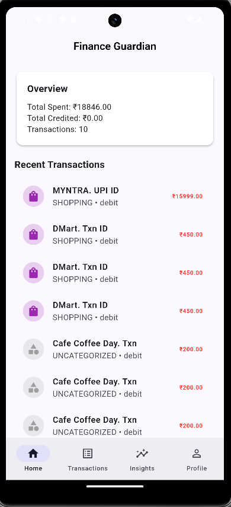
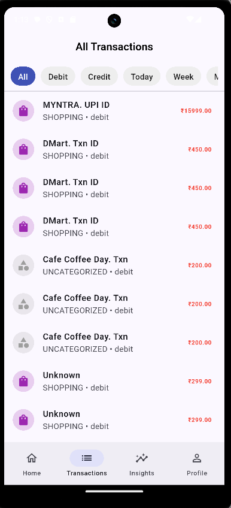
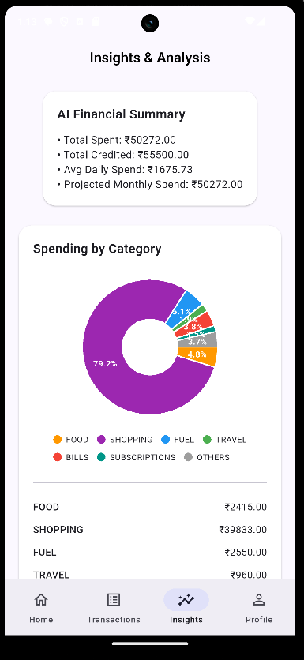
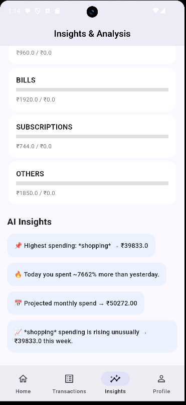
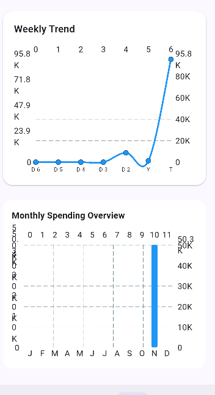
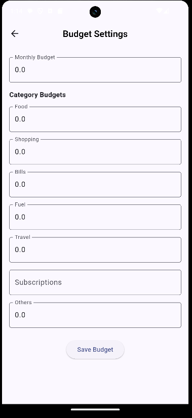
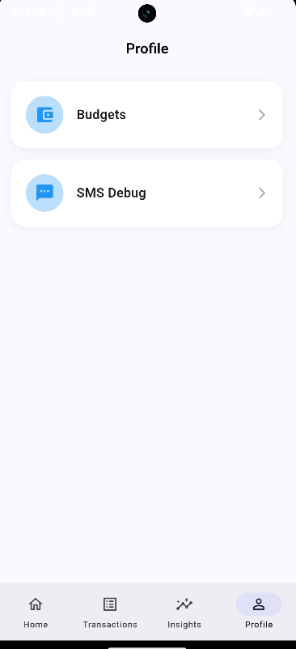

# 📌 Spenzly.AI — Your Smart Personal Finance Guardian

**Spenzly.AI is an AI-powered personal finance app that automatically reads bank/UPI SMS, extracts transactions, categorizes spending, tracks budgets, and generates insights — all without linking bank accounts.**  
Simple, secure, and accessible for everyone.

***

## 🚀 Features

- **🔍 Smart SMS Scanner**
  - Reads SMS safely – no internet or bank login needed.
  - Extracts amount, merchant, UPI ID, date, and transaction type.
  - *Privacy-first*: SMS content never leaves your device except for secure transaction storage.

- **💰 Auto Transaction Categorization**
  - AI-powered assignment: Food, Shopping, Fuel, Travel, Bills, Subscriptions, Others.

- **📊 Insights Dashboard**
  - Category Pie Chart
  - Weekly Trend Line & Monthly Bar Chart
  - Highest spending category, daily/weekly/monthly analytics

- **🤖 AI Insights**
  - Spending spikes, trend predictions, overspending warnings
  - Category-based tips and projected monthly spend

- **🎯 Budget Planner**
  - Category-wise budgets, real-time progress, limit alerts

- **📱 Beautiful UI**
  - Clean cards, Material 3 design, elegant animations

***

## 🛠️ Tech Stack

- **Flutter** (Frontend)
- **Firebase Auth** (Anonymous login)
- **Cloud Firestore** (Data storage)
- **SMS Inbox Reader** (Local)
- **fl_chart** (Charts)

***

## 🔐 Security

- SMS processed locally; only transaction data saved
- No bank login; no OTP reading; no data sent to external APIs
- Anonymous user auth (Firebase)

***

## 📦 Project Structure

```
lib/
 ├── app/
 ├── models/
 ├── screens/
 ├── services/
 ├── widgets/
 └── assets/
```

***

## 🧪 How Transaction Categorization Works

- `"Your a/c debited for payee Bala Medical for Rs. 60.00"`  
  → Bills / Medical
- `"UPI payment to Zomato"`  
  → Food
- `"Fuel transaction Rs 600"`  
  → Fuel

***

## 📸 App Screenshots


### 🏠 Home Screen


### 💳 Transactions


### 📊 Insights & Analysis



### 🎯 Weekly & Monthly Trends  


### 🧾 Budgets


### 🔍 Profile


***

## ▶️ Run Locally

```bash
flutter pub get
flutter run
```

***

## 📦 Build APK

```bash
flutter build apk --release
```

***

## 👤 Developer

B.Tech IT Student • Interested in Data Analytics & AI-driven Applications

Built this project as a learning initiative in:
AI-based insights, data parsing, and mobile app development.

***

## 📄 License

MIT

***
